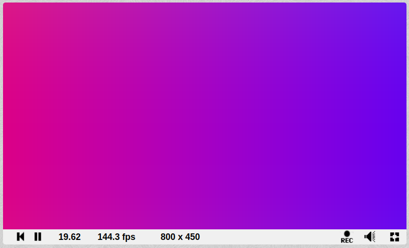

[](https://github.com/tterb/atomic-design-ui/blob/master/LICENSEs)
[](https://github.com/PurpleKingdomGames/ultraviolet/releases)
[](https://discord.gg/b5CD47g)
[](https://github.com/PurpleKingdomGames/ultraviolet/actions/workflows/ci.yml)

# Ultraviolet

Ultraviolet is a Scala 3 to GLSL (versions 100 and 300) transpiler library built on top of Scala 3 inline macros.

Examples can be found in the [examples directory of this repo](https://github.com/PurpleKingdomGames/ultraviolet/tree/main/examples/). You can use Ultraviolet to generate GLSL shader code for [Indigo](https://github.com/PurpleKingdomGames/indigo), and also for [ShaderToy](https://www.shadertoy.com/).

## Installation

Check the repo for the latest release number, and substitue the `x.y.z` below accordingly.

sbt

```
libraryDependencies += "io.indigoengine" %%% "ultraviolet" % "x.y.z"
```

Mill

```
def ivyDeps = Agg(ivy"io.indigoengine::ultraviolet::x.y.z")
```

Scala-CLI

```
//> using lib "io.indigoengine::ultraviolet:x.y.z"
```

## TL;DR: What is a Shader / Ultraviolet / basic programmer intuition

If you've stumbled across this repo and have no idea what all this shader stuff is about:

1. A shader program is used to render graphics on a GPU.
2. ***Think of a tiny C-like program that runs for every pixel on the screen***.
3. Ultraviolet allows you to write those programs in Scala 3.

## Example: ShaderToy's default program

This program can be run as a Scala-Cli script from [the examples](https://github.com/PurpleKingdomGames/ultraviolet/tree/main/examples/shadertoy) and the output pasted into [ShaderToy's editor](https://www.shadertoy.com/new). The code produced is almost the same as the default ShaderToy template, and when run, looks like this:



Here's the code:

```scala
import ultraviolet.shadertoy.*
import ultraviolet.syntax.*

inline def image =
  Shader[ShaderToyEnv, Unit] { env =>
    def mainImage(fragColor: vec4, fragCoord: vec2): vec4 = {
      // Normalized pixel coordinates (from 0 to 1)
      val uv: vec2 = fragCoord / env.iResolution.xy

      // Time varying pixel color
      val col: vec3 = 0.5f + 0.5f * cos(env.iTime + uv.xyx + vec3(0.0f, 2.0f, 4.0f))

      // Output to screen
      vec4(col, 1.0f)
    }
  }
```

The body has comments describing it take directly from the shader toy version, but let's walk through the Ultraviolet parts:

1. First we import ultraviolet's syntax and shadertoy support.
2. Then we define an `inline def` (important!) to hold our shader.
3. The shader takes a `ShaderToyEnv` environment (that provides globally available data like `iTime`) and in this case returns `Unit`.
4. The body is a function of environment (`env`) to our shader definition.
5. ShaderToy requires a `mainImage` function that is usually `void` in it's return type and you have to assign the output color to a known variable. With Ultraviolet's shader toy support, we return a `vec4` and the library will re-write it to do the right thing.

For comparison, here is the GLSL version ShaderToy provides:

```glsl
void mainImage( out vec4 fragColor, in vec2 fragCoord )
{
    // Normalized pixel coordinates (from 0 to 1)
    vec2 uv = fragCoord/iResolution.xy;

    // Time varying pixel color
    vec3 col = 0.5 + 0.5*cos(iTime+uv.xyx+vec3(0,2,4));

    // Output to screen
    fragColor = vec4(col,1.0);
}
```

Pretty similar! And in fact, converting GLSL examples to Scala + Ultraviolet tends to be quite a straightforward and mechanical process. Much work has been done to make the syntax feel the same or better.

## Status: "It works on my machine"

Ultraviolet is in early stage development. It appears to be working well but there will be many, many corner cases that haven't been found yet. Please report bugs and issues!

## Motivation

This project is motivated from two needs:

1. The most pressing need is that GLSL tooling is patchy, and I'd like to have a much better shadering writing experience both for myself and any other Scala devs whether they're writing shaders for [Indigo](https://indigoengine.io/), [ShaderToy](https://www.shadertoy.com/), or some other Scala frontend web framework.
2. Indigo is currently locked into WebGL 2.0, and to move to other platforms or rendering technologies means having some way to abstract away from that. 

## Current Goals

Right now, the goal is an almost like-for-like experience of writing GLSL (for WebGL) in Scala 3, in all it's very specific procedural glory. It includes a few quality of life improvements such as anonymous functions and function composition, but nothing fancy for now. You can even write unit tests!

The library may ultimately diverge from GLSL, and who knows what sort of problems have been caused by using GLSL as a starting point, but replacing GLSL with Scala GLSL-flavoured-shader-experience is the current goal.

It is _not_ a goal to be able to write arbirary Scala and have it turned into GLSL. In other words this isn't a 'full' transpiler (like Scala.js), it's a useful cross-over subset of Scala and GLSL. As many GLSL language features as can sensibly be represented, and as much Scala as GLSL can be coerced into expressing.

Ultimately I'd like to be able to write Shaders in FP friendly Scala that can target more than just GLSL 300, but that is not necessary for Ultraviolet to be useful and fun.

# Language feature comparison

***The goldren rule is: Keep It Simple!***

GLSL is not a general purpose language like Scala is, and while it's possible to represent most of GLSL in Scala, the opposite is not true.

GLSL is for doing maths on simple numeric data types and is, as someone else described it, "a very limited programming model."

For all that, it is _very good fun_. Go forth and do maths and make pretty pictures!

## Float's. Everywhere.

In GLSL 300 there are no double types. It was very tempting to make Ultraviolet accept `Double`s and write `Float`s for a nicer experience, but in later GLSL versions and other shader languages `Double` and `Float` are separate so Ultraviolet does 'the right thing' and the cost of some user experience.

Long story short: If you see an mysterious errors about constructors, you probably just wrote `1.0` instead of `1.0f`.

## Built in functions

GLSL comes LOADED with useful functions for doing all kinds of maths.

Since all of the implementations are well specified, Ultraviolet has fully implemented about 95% of them in Scala in order to help you write unit tests for your code.

The other 5% that cannot be implmented are stubbed, and simply return fixed values. `texture2D` for example will always return `vec4(0.0f)`.

## Gotcha's, foot guns, and weird stuff

### UX/DX/API rough edges

#### Indigo import collisions

If you're using Ultraviolet with Indigo, then you stand a chance of import collisions. The main culprits are that both Ultraviolet and Indigo contains instances of things like classes called `Shader` and `vec4`.

The simplest workaround here is to declare your UV shader code in an object in a separate file, or in a sub object as follows:

```scala
import indigo.* // <-- bring in problem imports

object MyCode:
  
  //...

  object MyShader:
    import ultraviolet.syntax.* // <-- problem import are effectively replaced

    inline def myShader = ???

```

#### Environment definitions

If your shaders environment is simple, like the shadertoy one, and can be defined using a single case class that may or may not also be declared as a UBO, then all is well.

More typically, you have some environment and several UBO definitions, and you'd like your code to be able to access all of them, e.g.:

```scala
final case class UBO1(count: Int)
final case class UBO2(pos: vec2)

// Delcare all this fields that make up `env`
Shader[FragmentEnv & UBO1 & UBO2] { env =>
  ubo[UBO1] // Tells ultraviolet to define the UBO1 data structure
  ubo[UBO2] // Tells ultraviolet to define the UBO1 data structure

  env.count // can be a field on FragmentEnv, UBO1, or UBO2
}
```

So far, the above works. The problem is that at the point of converting to GLSL code, you have to provide a dummy, but real instance of that funky type `FragmentEnv & UBO1 & UBO2`

You can't avoid declaring `UBO1` and `UBO2` because UV needs them to create the correct definitions, but making `FragmentEnv & UBO1 & UBO2` isn't a fun excercise.

Unfortunately, the best solution I've found so far is to replace `FragmentEnv & UBO1 & UBO2` with something like this:

```scala
final case class Env(count: Int, pos: vec2) extends FragmentEnvReference
object Env:
  def reference: Env = Env(0, vec2(0.0f))
```

Note that `FragmentEnv` is a real thing in Indigo, it provides Indigo's standard Fragment environment (there is also `VertexEnv` and `BlendFragmentEnv`). `FragmentEnvReference` is a trait with the same fields as `FragmentEnv`, with all the values hardcoded so that you can make an instance easily.

### Compile time and Runtime errors

> TL;DR: Some errors only happen at runtime, if you want to catch them early, write a simple test that exercises/run your shader.

Ultraviolet has a series of phases, some of which we can run at compile time, and some (currently) have to run at runtime:

1. (Compile) Generate shader AST from Scala code
2. (Compile) General program validation (e.g. forward reference checks)
3. (Runtime) Target specific validation (e.g. specific rules for targeting shadertoy)
4. (Runtime) Print the output

Compile time errors are the most common type of errors if you're using a standard output target like `.toGLSL[WebGL1]`/`.toGLSL[WebGL1]`.

If you are getting compile time validation errors and you want to see the output anyway, you can disable it with `.toGLSL[WebGL1](useValidation = false)`.

Runtime print errors are unusual, but the ones to look out for are from the **target specific validation phase**. An example of this kind of error would be that you've targeted shadertoy, but you haven't included a `mainImage` function, which is a requirement. There will be a runtime error to that effect, and the best why to find that ahead of time is just to write a simple test that forces the code to be evaluated. It could be as simple as:

`assert(myShaderToy.toGLSL[ShaderToy].toOutput.code.nonEmpty)`

### Strings? Where we're going, we don't need Strings.

GLSL is a C-like language for doing maths. There are no `Char` or `String` types.

### No functions as return types

Functions are not first class citizens in GLSL, and so it is not possible (currently) to have a function as a return type of a function. Simple function composition does work, and the `Shader` type forms a monad you can `map` and `flatMap` over.

### Limited support for product types

You cannot make or use arbitrary Product types. For example, it is tempting to just make a little tuple in order to return two values from a function... but you can't.

The closest thing you can do is make use of 'structs', which in Ultraviolet are represented by classes declared in the shader body - but it's usefulness is limited.

```scala
inline def fragment =
  Shader[Unit, Unit] { _ =>
    class Light(
        val eyePosOrDir: vec3,
        val isDirectional: Boolean,
        val intensity: vec3,
        val attenuation: Float
    )

    def makeLight(): Light =
      Light(vec3(1.0f), true, vec3(2.0f), 2.5f)

    def frag: Unit =
      val x = makeLight()
      val y = x.eyePosOrDir.y
  }
```

### No sum types

There is no way to represent anything like an enum, the closest you can get is using an `int` as a flag to switch on in a pattern match.

### No forward referencing

In Scala, you can call functions at the bottom of a program from code living at the top. This type of arrangement is called a forward reference, and is not allowed in GLSL.

There are compile time validation checks for this.

### No, your fancy library won't work here

Almost every language feature you have available via UltraViolet has required work to allow it to be converted to GLSL. Bringing in your favourite library that adds arbitrary functionality will not work.

### Nested functions and function purity

Because functions in Scala are first-class citizens, you can do all sorts of fancy things with them that we take for granted as Scala developers. One such thing is being able to arbitrarily nest functions.

In GLSL, functions are special, and can only exist at the top level of the program.

In general, this is manageable problem, but there are two rules to follow:

1. **'Named' functions e.g. `def foo(x: Float): vec2 = ???` _cannot_ be nested inside one another.** This is because Ultraviolet will preserve the order of your code including named functions, in order to avoid problems with forward references.
2. **Anonymous functions _can_ be nested, but _must be pure_.**. Ultraviolet will re-organise anonymous functions, this is what allows us to simulate things like function composition. The price is that anonymous functions must be pure, i.e. they can only produce a value based on their arguments, and cannot make reference to other outside entities that Scala would normally consider to be 'in scope'.

These rules should be enforced by compile time program validation for you.

### Just write a glsl as a String?

This is completely valid but only if it's the only contents of the block:

```scala
Shader {
  "int foo = 10;"
}
```

This is fine anywhere:


```scala
Shader {
  RawGLSL("int foo = 10;")
  // or
  raw("int bar = 11;")
}
```

But this will not work:

```scala
Shader {
  raw("int foo = 10;").trim
}
```

Because we can't do string-y things in GLSL, and trim is a string operation.

### Pattern matching weirdness

A pattern match is converted to a switch statement, and in GLSL you can only switch on an Int. So far that's limiting, but ok.

What is totally unintuitive is that on some graphics hardware, in some implmentations, switch statements will process ***all*** branches irrespective of whether they're going to be used or not.

The problem with that, is that if you declare the same variable name in two branches, the GLSL compiler will fail and tell you that you've redeclared it. Bonkers, but the takeaway is: Don't repeat variable names in pattern match branches...

### Unofficial reserved words

When writing shaders in Scala, Scala reserved words will be checked and errors shown by the compiler.

You shouldn't have too much trouble with GLSL reserved words because many of them have the same status in Scala, and Ultraviolets validation should catch all the others at compile time.

Naming conventions to avoid:
- Do not call a function something like `def xy(v: vec4): ???` because this will likely interfere with the Swizzle mechanisms (e.g. `vec3(1.0f).yx`). Not at the point of definition but at the point of use.
- Do not name anything `val0...N` or `def0...N`, as this is the naming scheme UltraViolet uses internally when it needs to create identifiers, and you'll end up in a mess. The `val` and `def` prefixes where picked in the hope the Scala people would naturally avoid them.

## Comparison table

Only included are the differences or note worthy features. If they're the same in both languages they are omitted.

| Feature                           | Scala | GLSL | Ultraviolet | Notes                                                                                            |
| --------------------------------- | ----- | ---- | ----------- | ------------------------------------------------------------------------------------------------ |
| Recursion                         | ✅     | ❌    | ❌           |
| A stack!                          | ✅     | ❌    | ❌           |
| `String` and `Char`               | ✅     | ❌    | ❌           |
| `uint` / `uvec`                   | ❌     | ✅    | ❌           |
| `Double` / `dvec`                 | ✅     | ❌    | ❌           |
| `struct`                          | ❌     | ✅    | 💡           | You can define structs by declaring classes.                                                     |
| for loops                         | ❌     | ✅    | 💡           | In Scala, use the `cfor` or `_for` methods provided to simulate for-loops.                                                        |
| Imports                           | ✅     | ❌    | ✅           | Imported methods and values must be inlined.                                                     |
| Switch statements                 | ❌     | ✅    | 💡           | Scala does not have switch statements, but they can be expressed using pattern matching instead. |
| If statements can return values   | ✅     | ❌    | ✅           |
| Pattern matches can return values | ✅     | ❌    | ✅           |
| `#define`                         | ❌     | ✅    | ✅           | Use the `@define` annotation. (see note below)                                                   |
| `const`                           | ❌     | ✅    | ✅           | `@const`                                                                                         |
| `uniform`                         | ❌     | ✅    | ✅           | `@uniform`                                                                                       |
| `varying`, `in`, `out`            | ❌     | ✅    | ✅           | `@in`, `@out`                                                                                    |
| `%` (modulus op)                  | ✅     | ❌    | ✅           |
| Lambda/Anonymous functions        | ✅     | ❌    | ✅           |
| `compose`                         | ✅     | ❌    | ✅           |
| `andThen`                         | ✅     | ❌    | ✅           |


Other comments:

- Although Ultraviolet is based primarily on GLSL 300, I've kept `texture2D` and `textureCube` from WebGL 1.0 for clarity, and these are automatically rewritten to `texture` for WebGL 2.0. 
- Preprocessor directives largely don't exist, but `#define` is supported for special cases where you need to define a global value based on a non-constant value.
- GLSL headers can be provided via `PrinterHeader`s.


## Things to know about inlining

Ultraviolet allows you to share / reuse code, as long as it is inlined following Scala 3's standard inlining rules. However there are things to know about how this will affect your GLSL!

Here, 'external' means 'not inside the body of your shader'.

- You cannot inline external `val`s.
- You can inline external `def`s into your code, but:
  - A def that is essentially a call by reference val such as `inline def x = 1.0f` will have it's value inlined.
  - A def that is a function, laid out like a method e.g. `inline def foo(c: Int): Int = c + 1` will be inlined.
  - A def that is an anonymous function will be embedded with a new name and will work exactly as you'd expect, i.e. `inline def foo: Int => Int = c => c + 1`
